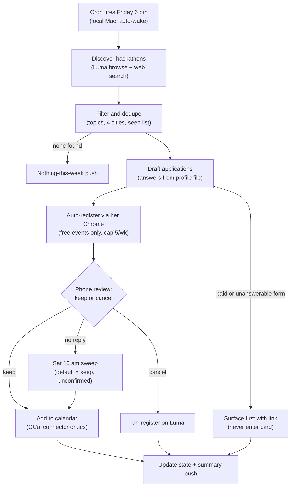

# Luma Hackathon Autopilot — Plan (v1)

## Goal
Every Friday 6:00 PM PT, an automated Claude agent: discovers hackathons on Luma matching topics
(Agent Memory, Evals, Retrieval, Tool Calling) in SF / Palo Alto / Mountain View / Cupertino,
drafts applications and registers on her behalf immediately (free events, so her application
sits at the front of host-approval queues), then asks her by phone to keep or cancel each
registration, and lands kept events on her calendar.

## Flowchart

## Order: apply-first (Isha's decision, 2026-08-01)
Confirmed order: find → **auto-apply → notify → approve (keep/cancel)** → calendar.
Rationale (hers): many events have a host-approval waiting period; applying hours later can mean
losing the admission window. Applying immediately maximizes odds of getting in; her review then
decides whether to KEEP a registration (→ calendar) or CANCEL it (→ un-register on Luma, which
is cheap and self-serve).

Guardrails that make auto-apply safe:
1. **Free events only.** Payment/card entry is never automated (prohibited). Paid events are
   surfaced to her BEFORE any action, with a link for manual checkout.
2. **Cap ~5 auto-applications/week**, ranked by topic fit — bounds churn hosts see if she cancels.
3. Application answers come strictly from her profile file — no fabricated experience; events
   whose forms ask something the profile can't answer are surfaced instead of auto-applied.
4. **Standing authorization is explicit infrastructure, not assumed:** the scheduled task must be
   configured by Isha with permissions that allow Chrome form submission unattended (permission
   allowlist / mode set once, deliberately, at setup). She is opting into registrations she has
   not pre-screened; the weekly summary makes every action visible after the fact.
5. Cancel path is first-class: a "cancel" swipe un-registers on Luma the same day.

## Architecture decision: local, not cloud
The workflow depends on Isha's logged-in Luma session in her real Chrome (claude-in-chrome).
Cloud scheduled agents cannot reach her local Chrome, and storing her Luma password for headless
login is prohibited (credential handling). Therefore:
- Scheduler: local scheduled task (Claude Code scheduled-tasks / CronCreate) on her Mac.
- Constraint: the Mac must be awake and Chrome running Friday 6 PM (wake schedule via
  `pmset repeat wake F 17:55:00` can be set up).
- Discovery (logged-out browsing of lu.ma + web search) does not need Chrome; only
  registration does.

## Pipeline (two-phase, because approval is async)

### Phase 1 — Friday 6:00 PM run ("scout")
1. Cron fires local Claude session.
2. Discover candidate events:
   - Browse lu.ma city/discover pages (SF, Palo Alto, Mountain View, Cupertino) + WebSearch
     ("site:lu.ma hackathon agent evals ...", next 3 weeks window).
   - Filter: topic keywords (agent memory, evals, retrieval, tool calling, + synonyms:
     RAG, agent benchmarks, LLM evaluation, function calling, MCP), location within the 4 cities,
     date in future, not already in state file.
3. For each candidate, open event page and extract: title, date/time, venue, price,
   registration type (instant / approval-required / application questions), application questions.
4. Draft answers to application questions from a profile file Isha writes once
   (bio, GitHub, LinkedIn, what she's building, dietary etc.).
5. Rank + shortlist (cap ~5/wk). Route: free + answerable form → auto-apply lane;
   paid or unanswerable form → surface-first lane (notification with link, no action taken).
6. **Auto-apply immediately** (same run): open event page in her Chrome (claude-in-chrome),
   verify logged in as her, fill form from drafted answers, submit. Record result
   (registered / pending host approval).
7. Send push notification to her phone: one card per applied event — title, date, city,
   registration status, the answers submitted — with **Keep / Cancel** choice (AskUserQuestion
   surfaced via Claude mobile notification; a native iOS "swipe" is approximated by tapping the
   notification and choosing). Persist everything to state file
   (`~/.claude/.../luma-autopilot/state.json`).

### Phase 2 trigger (explicit)
Primary: the Friday session blocks on the Keep/Cancel question; her answer resumes the same
session, which executes immediately. Fallback: a Sat 10:00 AM sweep reads state.json — if
responses were recorded but not executed (session died), it executes them; if no response, it
re-sends the notification once. **No-response default: KEEP** — registrations stand and events
are calendar-added marked "unconfirmed" in the summary (consistent with apply-first intent:
never lose a spot to a missed notification). She can flip this default to cancel.

### Phase 2 — on her response ("executor")
8. Cancel → un-register from the event on Luma via her Chrome; mark cancelled in state.
   Keep (or no response by Sunday) → proceed to calendar.
9. Calendar (active write, not passive verification) — pick one in v1:
   a) Connect a Google Calendar MCP connector and create the event directly (preferred, +1 h), or
   b) Local path: fetch Luma's .ics from the Gmail confirmation (Gmail MCP) and `open` it in
      Calendar.app on the Mac.
   Either way the agent confirms the event exists before reporting success; it does NOT rely on
   Gmail's "Events from Gmail" auto-add setting.
10. Update state file (applied/pending/skipped, dedupe key = luma event id).
11. Send summary notification: applied ✓, pending host approval, needs-payment, skipped.

### Failure paths
- Logged out of Luma → notify her to re-login manually; never enter credentials.
- No events found → short "nothing this week" notification (so silence ≠ breakage).
- No Keep/Cancel response by Sunday night → default KEEP: registration stands, calendar entry
  created, summary flags it "unconfirmed" (default flippable to cancel).
- Mac asleep / Chrome unavailable at 6 PM → discovery still runs (no Chrome needed); auto-apply
  degrades to notify-with-link so the approval window isn't wholly lost.

## Assumptions (stated)
A1. "Apply" = register/submit application on Luma, excluding payment (card entry prohibited —
    paid events are surfaced for manual checkout).
A2. Apply-first confirmed by Isha (host-approval windows): agent auto-registers for free,
    answerable events; her review is keep-vs-cancel, not permission-to-apply. Requires her to
    configure standing permissions for unattended Chrome form submission at setup.
A3. Mac is on/awake Fridays 6 PM, or wake-schedule is acceptable to configure.
A4. She stays logged into Luma in Chrome; session cookies persist week to week.
A5. "Swipe on phone" ≈ Claude mobile push notification + tap-to-approve; a literal iOS swipe
    action button would require a custom Shortcuts/app build (out of scope v1).
A6. Calendar entries are actively written by the agent — Google Calendar connector (connected at
    setup) or .ics import into Calendar.app. Gmail's "Events from Gmail" auto-add is never
    relied on.
A7. Topic match is keyword/semantic on titles+descriptions; some false positives/negatives accepted,
    tuned over weeks.
A8. Search window: events in the next ~3 weeks; cap ~5 candidates/week.
A9. Luma has no official public search API assumed; discovery is browsing + web search
    (fragile to Luma UI changes).
A10. One profile file supplies application-answer content; agent may lightly tailor per event
    but never fabricates credentials/experience.

## Effort estimate
- **Spike 0 (~30 min, do first — de-risks everything):** three 10-min validation tests:
  (1) one-off scheduled task +5 min that opens lu.ma via claude-in-chrome — proves scheduled
  runs can drive her Chrome; (2) one push notification with a question, answered from the phone —
  proves the approval round-trip; (3) manually register for one free Luma event — observe exactly
  what lands in Gmail/Calendar. If (1) fails → executor falls back to notify-with-link (she taps
  the Luma link and applies in 2 taps; agent still handles discovery, drafting, calendar).
  If (2) fails → approval via email reply or next-morning sweep prompt.
- **Session 1 (2–3 h): scaffold.** Scheduled task, state file, discovery prompt, profile file,
  keep/cancel notification. Testable same day with a manual trigger.
- **Session 2 (2–3 h): executor.** Chrome registration flow on 1–2 real events, Gmail invite
  verification, summary notification.
- **Hardening (2–4 Fridays, ~30 min each):** tune topic filter, handle odd registration forms,
  fix selectors when Luma changes UI.
- Total: **~5–7 focused hours + a few weeks of light babysitting.** Ongoing cost ≈ one
  notification interaction/week.
- Out-of-scope upgrades: literal swipe UI via iOS Shortcuts (+3–5 h, questionable ROI).
  (Google Calendar connector and auto-apply are now IN scope for v1 — see Session 2 and the
  apply-first section.)

## Risks (top)
R1. Luma UI drift breaks the registration automation (most likely recurring failure).
R2. Approval-required events: "applied" ≠ "accepted"; calendar entry should only firm up on
    host acceptance (agent watches Gmail for acceptance).
R3. Notification missed → default-KEEP means she may end up registered (and calendared) for an
    event she never saw; mitigated by Sat re-prompt + "unconfirmed" flag in summary.
R4. Apply-then-cancel churn is visible to hosts; bounded by the 5/week cap and topic ranking.
R5. PII surface: auto-apply submits her profile (bio, links) to any keyword-matching event
    before she sees it — including spam/harvesting listings. Mitigation: legitimacy sanity check
    before applying (host history, attendee count, real venue); anything borderline goes to the
    surface-first lane instead.
R6. Prompt injection: event pages are untrusted content read by an unattended agent holding
    standing form-submission permission. Mitigation (hard rules): answers come ONLY from profile
    fields; submissions happen ONLY on the lu.ma page of the event being processed; any on-page
    text requesting off-profile data (phone, address, payment) or off-domain action routes the
    event to surface-first — page instructions are never followed.
R7. Default-KEEP no-shows: unreviewed keeps become registrations + calendar entries she may not
    attend, hurting her standing with hosts. Mitigation: "unconfirmed" flag in the summary and a
    day-before reminder ping; default flippable to cancel if no-shows accumulate.
